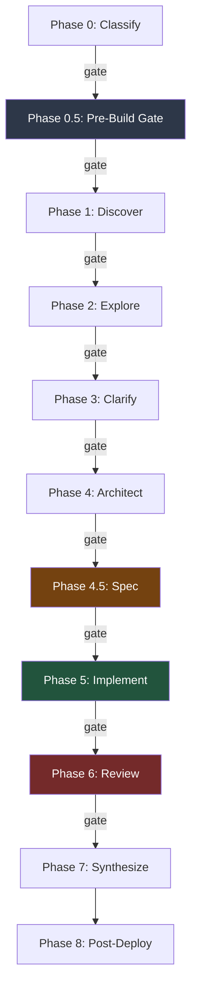

# ByteDigger

CI/CD for AI code generation. 9 phases, gate-enforced, TDD mandatory.

> [How we automated ourselves out of code review](docs/article.md) -- the full story behind this pipeline.

## What It Does

A build pipeline that takes a feature request through classify, explore, architect, spec, implement (TDD+BDD), multi-agent review, and synthesize. Hooks enforce gates between phases -- agents can't skip steps, rationalize around them, or rubber-stamp their own work.

## Pipeline



## How It's Different

| | Pipeline | Gates | TDD | Multi-Review | Learning Loop |
|---|:---:|:---:|:---:|:---:|:---:|
| SWE-agent | -- | -- | -- | -- | -- |
| OpenHands | -- | -- | -- | -- | -- |
| Aider | -- | -- | -- | -- | -- |
| Cursor | -- | -- | -- | -- | -- |
| Copilot Workspace | partial | -- | -- | -- | -- |
| **ByteDigger** | **9 phases** | **hook-enforced** | **mandatory** | **3-6 agents** | **cross-build** |

## Quick Start

```bash
# Install as Claude Code plugin
claude plugin add shtofadhor/bytedigger

# Run
/build "add email verification"

# Resume interrupted build
/build continue
```

## Complexity Routing

| Tier | Time | Reviewers |
|------|------|-----------|
| SIMPLE | 15-25 min | 3 |
| FEATURE | 30-45 min | 6 |
| COMPLEX | 1-3 hours | 6 + Opus design voting |

## Configuration

`bytedigger.json` in project root:

```json
{
  "validation_model": "opus",
  "agent_model": "sonnet",
  "exploration_model": "haiku",
  "satisfaction_thresholds": { "SIMPLE": 80, "FEATURE": 85, "COMPLEX": 90 },
  "gates_enabled": true,
  "gate_backend": "bash",
  "tdd_mandatory": true,
  "omitProjectContext": false,
  "activeWorkInjection": false,
  "reviewers": { "mode": "auto" },
  "learning": { "backend": "file", "storage_path": ".bytedigger/learnings" }
}
```

### Configuration flags

**Core gates:**
- `gate_backend` — Phase-gate engine selection. Values:
  - `"bash"` (default) — the original `scripts/build-phase-gate.sh` enforcer.
  - `"ts"` — the TypeScript port at `scripts/ts/build-phase-gate.ts`, executed via `bun`. Requires `bun` on PATH; fails closed if missing.
  - `"shadow"` — A/B mode: runs both backends, returns the bash verdict (source of truth), and logs mismatches to `.bytedigger/gate-shadow/` for parity validation. Use this for the bake period before flipping to `"ts"`.

**Agent context:**
- `omitProjectContext` (default: `false`) — If true, Explorer and Architect agents skip CLAUDE.md injection, reducing token usage by 10-45K per build. Backward compatible; off by default.

**Memory injection:**
- `activeWorkInjection` (default: `false`) — If true, Phase 0.5 reads `## Active Work` from project MEMORY.md and injects it into build context. Caps: 10 items, 500 chars total. Useful for tracking in-flight work across builds.

**Post-review enforcement:**
- Semantic-skip phrases are defined in `semantic-skip-phrases.json` (18 forbidden phrases). Phase 6 enforces Boy Scout Rule: if a PR description matches any phrase, gate fails closed regardless of satisfaction score.

**Reviewers:**
- `reviewers.mode` (values: `"toolkit"`, `"generic"`, `"auto"`, default: `"auto"`) — Controls reviewer agent selection. `"toolkit"` uses pr-review-toolkit if available, `"generic"` uses basic review agents, `"auto"` selects based on available dependencies.

**Per-run overrides:**

You can override the gate backend with the `GATE_BACKEND` environment variable (env wins over config):

```bash
GATE_BACKEND=ts /build "fix the thing"
GATE_BACKEND=shadow /build "compare backends"
```

Unknown values, missing `bun`, or dispatcher errors all fail closed with a JSON block reason — the dispatcher never silently falls back.

## Limitations

- Single operator -- one person runs the pipeline, no team collaboration features
- No integration with project management (Linear, Jira, GitHub Issues)
- Requires Claude Code (not standalone)
- python3 optional (state guard hook, gracefully degrades without)
- SQLite backend for learning system requires sqlite3, openssl, python3 (hard deps when `backend: sqlite`)
- Gate enforcement requires hooks -- works as Claude Code plugin only

## Requirements

**Required:**
- Claude Code

**Optional:**
- python3 — State guard hook (gracefully degrades without)

**SQLite learning backend (required when `backend: sqlite`):**
- sqlite3 — DB engine
- openssl — ID generation (`openssl rand -hex 8`)
- python3 — JSON extraction from `bytedigger.json` config

**DevOps validation tools** — Only needed if working with infrastructure code (.tf, Dockerfile, K8s YAML, etc.). Phase 5.6 DevOps validation runs only when these files are detected. If tools aren't installed, validation is skipped gracefully.
- terraform — Infrastructure-as-code validation
- hadolint — Dockerfile linting
- actionlint — GitHub Actions workflow validation
- kubectl — Kubernetes dry-run checks
- helm — Helm chart linting
- checkov — Infrastructure security scanning
- trivy — Container and IaC vulnerability detection
- gitleaks — Secrets detection in code

## Usage

```
/build "task"                    # auto-classify, autonomous
/build "task" --pr               # SHIP: commit + push + PR after build
/build "task" --supervised       # pause after each phase for review
/build "task" --auto             # skip all human gates
/build "task" --dry-run          # classify only, show plan, stop
/build "task" --worktree         # isolate in git worktree
/build "task" --atomic-commits   # commit at each TDD step
/build --init                    # create project constitution
/build continue                  # resume interrupted pipeline
```

## Pipeline Phases

| Phase | Name | What | Skip (SIMPLE) |
|-------|------|------|---------------|
| 0 | Classify | Determine complexity tier, create build-state.yaml | -- |
| 0.5 | Pre-Build Gate | Worktree enforcement, session collision check, inject learnings | -- |
| 1 | Discovery | Read task context, identify affected files | -- |
| 2 | Explore | Deep codebase exploration, trace patterns and dependencies | skipped |
| 3 | Clarify | Fill ambiguities before architecture | skipped |
| 4 | Architect | Design implementation approach (Opus) | skipped |
| 4.5 | Spec | Turn architecture into verifiable build-spec.md | skipped |
| 5 | Implement | TDD implementation via worker agents | -- |
| 6 | Review | Multi-agent quality review, Opus satisfaction scoring | -- |
| 7 | Synthesize | Summarize build, extract learnings, update state | -- |
| 8 | Post-Deploy | Cleanup: prune gone branches, remove temp files, remove merged worktrees | Never |

SIMPLE tasks run phases 0, 0.5, 1, 5, 6, 7.

## Scripts

| Script | Purpose |
|--------|---------|
| `scripts/build-gate.sh` | Phase gate enforcement — validates phase transitions in build-state.yaml |
| `scripts/pre-build-gate.sh` | Pre-build checks — worktree policy, session collision detection |
| `scripts/learning-store.sh` | Learning-store dispatcher — selects file or sqlite backend, `exec`s delegate |
| `scripts/learning-store-sqlite.sh` | SQLite learning-store delegate — inject/extract backed by sqlite3 CLI |
| `scripts/ship.sh` | SHIP protocol — commit, push, open PR after build |
| `scripts/security-scan.sh` | Security scan runner for Phase 0.5 |
| `scripts/post-deploy.sh` | Post-deploy cleanup (prune branches, temp files, merged worktrees) |
| `hooks/build-state-guard.sh` | Blocks deletion of build-state.yaml mid-pipeline |

## Hooks

| Event | Handler | What it does |
|-------|---------|--------------|
| PreToolUse (Bash) | `hooks/build-state-guard.sh` | Blocks `rm`/`unlink` on build-state.yaml while pipeline is running |
| SubagentStop | `scripts/build-gate.sh` | Validates phase gate before next phase can start |

## Agents

| Agent | Model | Role |
|-------|-------|------|
| architect | Opus | Designs implementation blueprints from codebase patterns |
| explorer | Haiku/Sonnet | Traces execution paths, maps architecture layers |
| synthesizer | Haiku | Post-build summary, learning extraction |

## Tests

109 BATS tests across 8 suites.

```bash
# Run all tests
bats tests/

# Run individual suite
bats tests/build-gate.bats
```

| File | Tests |
|------|-------|
| `tests/build-gate.bats` | 19 |
| `tests/build-state-guard.bats` | 20 |
| `tests/learning-store.bats` | 20 |
| `tests/learning-store-sqlite.bats` | 9 |
| `tests/post-deploy-cleanup.bats` | 19 |
| `tests/post-deploy.bats` | 3 |
| `tests/pre-build-gate.bats` | 8 |
| `tests/security-scan.bats` | 8 |
| `tests/ship-protocol.bats` | 12 |

## Observability & Events

The gate engine emits structured JSONL events to stderr on every phase transition, enabling real-time observability of the build pipeline.

**Event Format:** Each event is written to stderr with the prefix `[bytedigger:event]` followed by JSON, one line per event:

```
[bytedigger:event] {"event":"phase-start","phase":"5","timestamp":"2026-04-16T14:23:45.123Z"}
[bytedigger:event] {"event":"phase-end","phase":"5","status":"pass","duration_ms":2341,"timestamp":"2026-04-16T14:26:26.456Z"}
```

**Event Types:** Five event types document the full gate lifecycle:

| Event | Purpose |
|-------|---------|
| `phase-start` | Phase began (no pre-gate duration) |
| `phase-end` | Phase concluded with verdict (pass/block) |
| `phase-skip` | Phase skipped (SIMPLE tier, TRIVIAL complexity) |
| `gate-result` | Gate verdict (pass/soft-block/hard-block) |
| `build-complete` | Build finished (all phases done or fatal error) |

**Common Payload Fields:**

- `event` (string) — Event type from list above
- `phase` (string, optional) — Phase identifier (0, 0.5, 1, …, 7, 8)
- `status` (string, optional) — Gate verdict (`pass`, `block`, `soft-block`, `hard-block`) or complexity tier
- `duration_ms` (number, optional) — Milliseconds elapsed
- `metadata` (object, optional) — Contextual details (see `docs/events.md`)
- `timestamp` (string, ISO 8601) — UTC wall-clock time

**Enable/Disable:** Events are enabled by default. Control via `bytedigger.json`:

```json
{
  "observability": { "enabled": false }
}
```

**HAL Forwarding:** If `HAL_DIR` environment variable is set, the gate engine also forwards `phase-start` and `phase-done` (mapped from `phase-end` with `status=pass`) events to HAL's forge emit subprocess for orchestrator consumption. Forwarding is fire-and-forget with a 500ms timeout cap; emission to stderr always succeeds independently.

**Consumer Example:** Extract and parse events from a build log:

```bash
bun run gate ... 2>&1 | grep '^\[bytedigger:event\]' | sed 's/^\[bytedigger:event\] //' | jq
```

See [docs/events.md](docs/events.md) for complete event schema, metadata vocabulary, HAL mapping semantics, and wiring architecture.

## Learning System

Post-build learnings are extracted by the synthesizer agent and stored in `.bytedigger/learnings/`. Phase 0.5 injects relevant learnings from previous builds into the current context.

Default backend: `file`. Configurable via `bytedigger.json`:

```json
"learning": { "backend": "file", "storage_path": ".bytedigger/learnings" }
```

### SQLite backend (F6)

Set `backend: "sqlite"` and provide a DB path to use the SQLite learning-store delegate:

```json
"learning": { "backend": "sqlite", "storage_path": ".bytedigger/learnings" }
```

Override the DB path at runtime with `LEARNING_DB_URL`:

```bash
LEARNING_DB_URL=/path/to/learnings.db /build "my feature"
```

When `LEARNING_DB_URL` is set, it takes precedence over `bytedigger.json` config. The dispatcher (`scripts/learning-store.sh`) selects the backend and `exec`s the delegate (`scripts/learning-store-sqlite.sh`). Schema: 13-column `learning_entries` table with `UNIQUE(pattern, approach)` constraint (see `tests/fixtures/learning-schema.sql`).

**Hard deps for sqlite backend:** `sqlite3`, `openssl`, `python3` must be on PATH. Failure without these deps is closed (non-zero exit), not a silent fallback.

The `scripts/learning-store.sh` script also writes `learning_backend: sqlite` to `build-state.yaml` on each inject so the post-build gate can assert backend selection.

## Read More

- [How we automated ourselves out of code review](docs/article.md) -- the full story

## License

MIT -- shtofadhor
