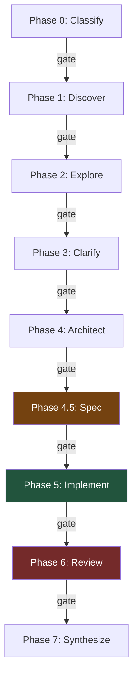

# ByteDigger

CI/CD for AI code generation. 8 phases, gate-enforced, TDD mandatory.

> [How we automated ourselves out of code review](docs/article.md) -- the full story behind this pipeline.

## What It Does

A build pipeline that takes a feature request through classify, explore, architect, spec, implement (TDD+BDD), multi-agent review, and synthesize. Hooks enforce gates between phases -- agents can't skip steps, rationalize around them, or rubber-stamp their own work.

## Pipeline



## How It's Different

| | Pipeline | Gates | TDD | Multi-Review | Learning Loop |
|---|:---:|:---:|:---:|:---:|:---:|
| SWE-agent | -- | -- | -- | -- | -- |
| OpenHands | -- | -- | -- | -- | -- |
| Aider | -- | -- | -- | -- | -- |
| Cursor | -- | -- | -- | -- | -- |
| Copilot Workspace | partial | -- | -- | -- | -- |
| **ByteDigger** | **8 phases** | **hook-enforced** | **mandatory** | **3-6 agents** | **cross-build** |

## Quick Start

```bash
# Install as Claude Code plugin
claude plugin add shtofadhor/bytedigger

# Run
/build "add email verification"

# Resume interrupted build
/build continue
```

## Complexity Routing

| Tier | Time | Reviewers |
|------|------|-----------|
| SIMPLE | 15-25 min | 3 |
| FEATURE | 30-45 min | 6 |
| COMPLEX | 1-3 hours | 6 + Opus design voting |

## Configuration

`bytedigger.json` in project root:

```json
{
  "validation_model": "opus",
  "agent_model": "sonnet",
  "satisfaction_thresholds": { "SIMPLE": 80, "FEATURE": 85, "COMPLEX": 90 },
  "gates_enabled": true,
  "tdd_mandatory": true,
  "learning": { "backend": "file", "storage_path": ".bytedigger/learnings" }
}
```

## Limitations

- Single operator -- one person runs the pipeline, no team collaboration features
- No integration with project management (Linear, Jira, GitHub Issues)
- Requires Claude Code (not standalone)
- python3 optional (state guard hook, gracefully degrades without)
- Gate enforcement requires hooks -- works as Claude Code plugin only

## Requirements

**Required:**
- Claude Code

**Optional:**
- python3 — State guard hook (gracefully degrades without)

**DevOps validation tools** — Only needed if working with infrastructure code (.tf, Dockerfile, K8s YAML, etc.). Phase 5.6 DevOps validation runs only when these files are detected. If tools aren't installed, validation is skipped gracefully.
- terraform — Infrastructure-as-code validation
- hadolint — Dockerfile linting
- actionlint — GitHub Actions workflow validation
- kubectl — Kubernetes dry-run checks
- helm — Helm chart linting
- checkov — Infrastructure security scanning
- trivy — Container and IaC vulnerability detection
- gitleaks — Secrets detection in code

## Read More

- [How we automated ourselves out of code review](docs/article.md) -- the full story

## License

MIT -- Guy Lifshitz
